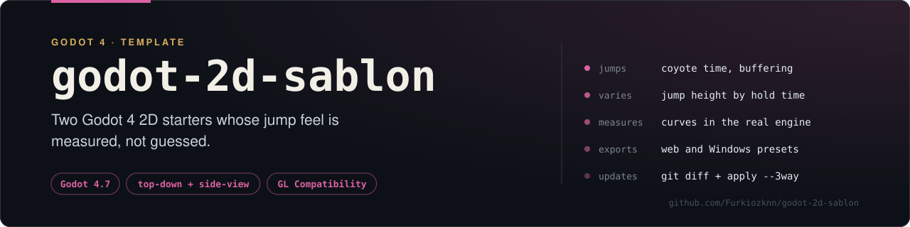

# Godot 2D Şablonları

**Godot 4.7 için iki çalışır durumda 2D iskelet proje: üstten görünüm ve yandan görünüm.**
Boş bir proje açıp hareket kodunu sıfırdan yazmak yerine, hissi ayarlanmış bir
karakter denetleyicisiyle başlayın.

> **English:** Two ready-to-run Godot 4.7 2D starter projects — a top-down
> controller (8-directional, accelerated) and a side-scroller with coyote time,
> jump buffering and variable jump height. Configured for the GL Compatibility
> renderer and pixel-perfect rendering. Turkish-language source comments.

[](https://godotengine.org/)
[](#neden-gl-compatibility)
[](LICENSE)

---

## Ne var içinde

| Klasör | Tür | İçerik |
|---|---|---|
| `ustten-gorunum/` | Top-down | 8 yönlü ivmeli hareket, sınırlı oda, takip eden kamera, TileMapLayer hazır |
| `yandan-gorunum/` | Side-scroller | Yerçekimi, kojot süresi, zıplama tamponu, değişken zıplama yüksekliği, 2 platform |

İki proje de bağımsızdır: birini kopyalayıp doğrudan kendi oyununuza
dönüştürebilirsiniz.

## Hemen çalıştır

Godot 4.7 kurulu olmalı. Depoyu klonlayın ve iki projeden birini açın:

```bash
git clone https://github.com/Furkiozknn/godot-2d-sablon.git
cd godot-2d-sablon

godot --path ustten-gorunum
godot --path yandan-gorunum
```

Ya da Godot'u açıp **Import** ile ilgili klasördeki `project.godot` dosyasını seçin.

**Kontroller**

| | Üstten görünüm | Yandan görünüm |
|---|---|---|
| Hareket | `WASD` / yön tuşları | `A` `D` / sol-sağ |
| Zıplama | — | `Boşluk` veya `W` |
| Etkileşim | `E` | — |

> `etkilesim` (E) girdi eylemi tanımlı ama henüz hiçbir koda bağlı değil;
> kendi etkileşiminizi bağlamanız için hazır bekliyor.

## Yandan görünümdeki üç önemli detay

`yandan-gorunum/scripts/oyuncu.gd` içinde platform oyunlarını "iyi hissettiren"
üç teknik var. Bunlar olmadan oyun teknik olarak çalışır ama hantal hissettirir:


<sub><i>Yukarıdaki eğrilerin hiçbiri elle çizilmedi: `oyuncu.gd`'nin `_physics_process`
gövdesi aynı sabitlerle, projenin 60 Hz sabit adımıyla koşturuldu ve çıkan konumlar
çizildi. 58 px, teorik `v²/2g` değeri olan 55,6 px'ten büyük — aradaki fark ayrık
entegrasyonun kendisi, ve oyunda hissettiğiniz de bu. Sayıları kendiniz üretmek için:
`python3 arac/zipla-egrisi.py` — Windows'ta `python arac\zipla-egrisi.py`. Bağımlılık yok.</i></sub>

1. **Kojot süresi** (coyote time) — platformun kenarından düştükten sonra
   0,12 saniye daha zıplayabilirsiniz. Oyuncu "tam basmıştım" hissi yaşamaz.
   (`oyuncu.gd`, `_kojot`)
2. **Zıplama tamponu** (jump buffer) — yere inmeden hemen önce boşluğa
   bastıysanız, yere değdiğiniz an zıplarsınız. Basılan tuş yutulmaz.
   (`oyuncu.gd`, `_tampon`)
3. **Değişken zıplama yüksekliği** — tuşu erken bırakırsanız zıplama kısalır
   (`velocity.y *= 0.45`). Kısa/uzun zıplama kontrolü verir.

Değerler `@export` ile dışa açık: editörde `Oyuncu` düğümünü seçip
Inspector'dan deneyerek ayarlayın.

## Neden GL Compatibility

Godot 4'ün varsayılan **Forward+** renderer'ı Vulkan ister. Tümleşik Intel GPU'lar
ve eski sürücülerde bu kombinasyon çökme ve doğrulama hatası üretebiliyor. Her iki
proje de **GL Compatibility** renderer'ına ayarlı:

```ini
renderer/rendering_method="gl_compatibility"
```

Bu bir taviz değil — 2D için zaten doğru seçim: daha hafif, tümleşik GPU'da daha
hızlı, web export'u sorunsuz.

Pixel art için ayarlanan diğer değerler:

| Ayar | Değer | Neden |
|---|---|---|
| Taban çözünürlük | 640×360 (pencere 1280×720) | 2×, 3× tam kat ölçekler |
| `stretch/mode` | `canvas_items` + `aspect=keep` | Piksel bozulmaz |
| `default_texture_filter` | `0` (nearest) | Pixel art bulanıklaşmaz |
| `snap_2d_transforms_to_pixel` | `true` | Titreme (jitter) olmaz |
| Fizik tick | 60 | Sabit adım |

## Proje yapısı

```
<proje>/
  project.godot        proje ayarları (renderer, girdi eylemleri, çözünürlük)
  export_presets.cfg   Windows Masaüstü + Web (HTML5) hedefleri
  icon.svg             yer tutucu ikon — kendinizinkiyle değiştirin
  scenes/
    level.tscn         ana sahne
    oyuncu.tscn        oyuncu sahnesi
  scripts/
    oyuncu.gd          karakter denetleyicisi
  assets/
    sprites/           görseller
```

`assets/` altına kendi `audio/`, `fonts/` klasörlerinizi ekleyebilirsiniz;
şablon bunları varsaymaz.

Depo kökündeki iki klasör projelerin parçası değildir: `docs/` README
görselleri, `arac/` ise o görsellerin sayılarını üreten betiktir.

## Dışa aktarma

`export_presets.cfg` iki hedefle hazır gelir:

```bash
godot --headless --path ustten-gorunum --export-release "Windows Masaustu"
godot --headless --path ustten-gorunum --export-release "Web (HTML5)"
```

Çıktılar `build/windows/` ve `build/web/` altına düşer (bunlar `.gitignore`'da).
İlgili Godot **export template**'lerinin kurulu olması gerekir.

## Nasıl devam edilir

1. 16×16 veya 32×32 bir karakter çizip `assets/sprites/` içine PNG kaydedin
   (Pixelorama, Aseprite, Krita — hangisi elinizdeyse).
2. `Gorsel` düğümünü `AnimatedSprite2D`'ye çevirip `SpriteFrames` oluşturun
   (yandan görünümde zaten `AnimatedSprite2D` ve `idle`/`yuru`/`zipla`/`dus`
   animasyon adları bekleniyor).
3. Üstten görünümde zemin için **TileMapLayer** ekleyin — Godot'un dahili
   tilemap editörü yeterli, harici bir araca gerek yok.
4. Ses için `AudioStreamPlayer2D` ekleyin.

## Katkı

Hata bildirimi ve öneriler için issue açın. Kod katkısı gönderiyorsanız her iki
projenin de Godot 4.7 ile hatasız içe aktarıldığını doğrulayın:

```bash
godot --headless --path ustten-gorunum --quit
godot --headless --path yandan-gorunum --quit
```

## Lisans

[MIT](LICENSE) — şablonları dilediğiniz gibi kullanın, kredi vermeniz gerekmez.
