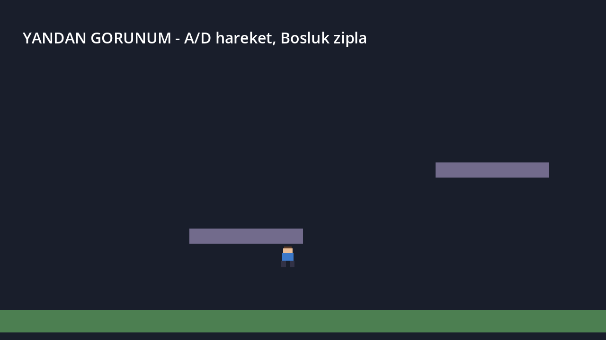
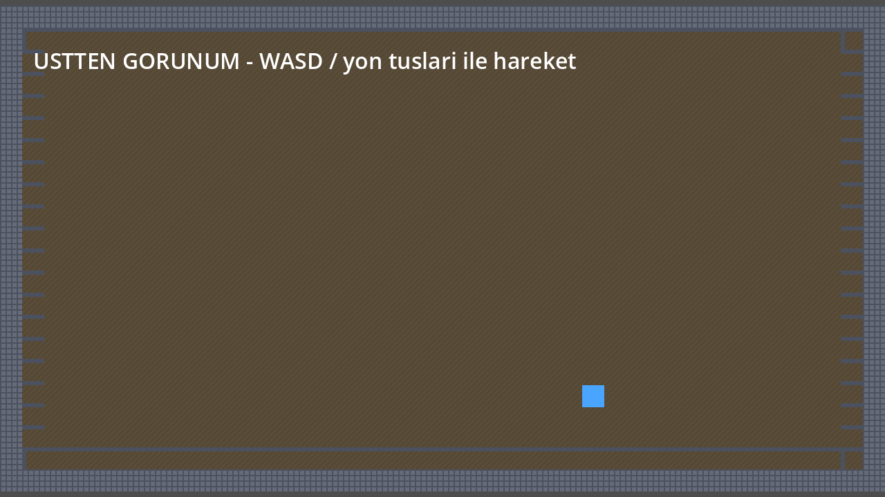

# Godot 2D Şablonları

**Godot 4.7 için iki çalışır durumda 2D iskelet proje: üstten görünüm ve yandan görünüm.**
Boş bir proje açıp hareket kodunu sıfırdan yazmak yerine, hissi ayarlanmış bir
karakter denetleyicisiyle başlayın.

> **English:** Two ready-to-run Godot 4.7 2D starter projects — a top-down
> controller (8-directional, accelerated) and a side-scroller with coyote time,
> jump buffering and variable jump height. Configured for the GL Compatibility
> renderer and pixel-perfect rendering. Turkish-language source comments.
> Start a game by copying one folder and recording the template commit in
> `SABLON_SURUMU`; later fixes come in with `git diff --relative` +
> `git apply --3way` (see *Şablon güncellemelerini almak*). The jump numbers
> are simulated in Python and cross-checked against real Godot 4.7.2 in CI.

[](https://github.com/Furkiozknn/godot-2d-sablon/actions/workflows/ci.yml)
[](https://godotengine.org/)
[](#neden-gl-compatibility)
[](LICENSE)

---

<table>
<tr>
<td width="50%"></td>
<td width="50%"></td>
</tr>
<tr>
<td align="center"><sub><code>yandan-gorunum/</code> — zıplama sırasında</sub></td>
<td align="center"><sub><code>ustten-gorunum/</code> — sınırlı oda</sub></td>
</tr>
</table>

<sub>İki görüntü de elle hazırlanmadı: projelerin kendi <code>Web (HTML5)</code>
preset'iyle Godot 4.7.2'den dışa aktarılıp tarayıcıda (headless Chromium)
oynanırken alındı.</sub>

## Ne var içinde

| Klasör | Tür | İçerik |
|---|---|---|
| `ustten-gorunum/` | Top-down | 8 yönlü ivmeli hareket, duvarlarla çevrili oda (TileMapLayer), sınırlı takip kamerası |
| `yandan-gorunum/` | Side-scroller | Yerçekimi, kojot süresi, zıplama tamponu, değişken zıplama yüksekliği, 4 animasyon, 2 platform |

İki proje birbirinden bağımsızdır: birini kopyalayıp doğrudan kendi oyununuza
dönüştürürsünüz. Depo kökündeki `arac/`, `testler/` ve `docs/` projelerin
parçası değildir; kopyalamanız gerekmez.

## Hızlı başlangıç

Gerekli olan tek şey [Godot 4.7](https://godotengine.org/) (standart sürüm,
.NET değil). CI her değişikliği **4.7.2-stable** ile doğruluyor.

**Denemek için** — depoyu klonlayıp iki projeden birini açın:

```bash
git clone https://github.com/Furkiozknn/godot-2d-sablon.git
cd godot-2d-sablon

godot -e --path yandan-gorunum                    # editörde açar; F5 ile oynatın
```

Editörü açmadan doğrudan oynatmak isterseniz, taze bir klonda önce görselleri
bir kez içe aktarın — yoksa Godot `.godot/imported/...` bulamaz ve karakter
görünmez:

```bash
godot --headless --path yandan-gorunum --import   # ilk seferde, bir kez
godot --path yandan-gorunum                        # oyunu çalıştırır
```

Komut satırı yerine: Godot Proje Yöneticisi → **Import** → ilgili klasördeki
`project.godot` (editör içe aktarmayı kendisi yapar).

**Kendi oyununuzu başlatmak için** — bir projeyi kendi klasörünüze kopyalayın
ve hangi şablon commit'inden başladığınızı not edin (ileride düzeltmeleri
almak için gerekecek, bkz. [Şablon güncellemelerini almak](#şablon-güncellemelerini-almak)):

```bash
git clone https://github.com/Furkiozknn/godot-2d-sablon.git
cp -r godot-2d-sablon/yandan-gorunum benim-oyunum
git -C godot-2d-sablon rev-parse HEAD > benim-oyunum/SABLON_SURUMU

cd benim-oyunum
git init && git add -A && git commit -m "godot-2d-sablon'dan basla"
godot -e --path .
```

Sonra editörde **Project → Project Settings → Application → Config → Name**
alanını kendi oyununuzun adıyla değiştirin.

**Kontroller**

| | Üstten görünüm | Yandan görünüm |
|---|---|---|
| Hareket | `WASD` / yön tuşları | `A` `D` / sol-sağ |
| Zıplama | — | `Boşluk` veya `W` |
| Etkileşim | `E` | — |

> `etkilesim` (E, üstten) ve `asagi` (S / aşağı ok, yandan) girdi eylemleri
> tanımlı ama henüz hiçbir koda bağlı değil; kendi etkileşiminizi, aşağı
> inme ya da eğilme davranışınızı bağlamanız için hazır bekliyorlar.

## Yandan görünümdeki üç önemli detay

`yandan-gorunum/scripts/oyuncu.gd` içinde platform oyunlarını "iyi hissettiren"
üç teknik var. Bunlar olmadan oyun teknik olarak çalışır ama hantal hissettirir:


<sub><i>Yukarıdaki eğrilerin hiçbiri elle çizilmedi: `oyuncu.gd`'nin `_physics_process`
gövdesi aynı sabitlerle, projenin 60 Hz sabit adımıyla koşturuldu ve çıkan konumlar
çizildi. 58 px, teorik `v²/2g` değeri olan 55,6 px'ten büyük — aradaki fark ayrık
entegrasyonun kendisi, ve oyunda hissettiğiniz de bu. Sayıları kendiniz üretmek için:
`python3 arac/zipla-egrisi.py` — Windows'ta `python arac\zipla-egrisi.py`. Bağımlılık yok.
Bu betik gövdenin Python'a taşınmış kopyası; aynı senaryolar her PR'da gerçek Godot
4.7.2'de de ölçülüp karşılaştırılıyor (bkz. [Sayılar nasıl korunuyor](#sayılar-nasıl-korunuyor)).</i></sub>

1. **Kojot süresi** (coyote time) — platformun kenarından düştükten sonra
   0,12 saniye daha zıplayabilirsiniz. Oyuncu "tam basmıştım" hissi yaşamaz.
   (`oyuncu.gd`, `_kojot`)
2. **Zıplama tamponu** (jump buffer) — yere inmeden hemen önce boşluğa
   bastıysanız, yere değdiğiniz an zıplarsınız. Basılan tuş yutulmaz.
   (`oyuncu.gd`, `_tampon`)
3. **Değişken zıplama yüksekliği** — tuşu erken bırakırsanız zıplama kısalır
   (`velocity.y *= kesme_carpani`). Kısa/uzun zıplama kontrolü verir.

## Ayarlar

Hareketin bütün sayıları `@export` ile dışa açık: editörde `scenes/oyuncu.tscn`'i
açın, kök `Oyuncu` düğümünü seçin, Inspector'dan değiştirip **F5** ile deneyin.
Seviyedeki tek bir örneği farklı ayarlamak isterseniz `level.tscn` içindeki
`Oyuncu`'yu seçin; oradaki değer yalnızca o örneği etkiler.

**`yandan-gorunum/scripts/oyuncu.gd`**

<!-- ayarlar:yandan -->
| Ayar | Varsayılan | Ne yapar |
|---|---|---|
| `hiz` | 130 | Yatay azami hız (px/s) |
| `zipla_gucu` | 330 | Zıplamanın ilk yukarı hızı (px/s) — tepe yüksekliği bunun karesiyle büyür |
| `yercekimi` | 980 | Aşağı ivme (px/s²) |
| `hava_kontrolu` | 0.85 | Havadayken yatay ivme / sürtünme çarpanı (1 = yerdeki kadar) |
| `kojot_suresi` | 0.12 | Kenardan düştükten sonra hâlâ zıplanabilen süre (s) |
| `zipla_tampon_suresi` | 0.12 | İnişten önce basılan tuşun hatırlandığı süre (s) |
| `kesme_carpani` | 0.45 | Tuş erken bırakılınca yukarı hız bununla çarpılır (küçük = kısa zıplama) |
| `ivme` | 1400 | Yatay hızlanma (px/s²) |
| `surtunme` | 1200 | Tuş bırakılınca yatay yavaşlama (px/s²) |
<!-- /ayarlar:yandan -->

**`ustten-gorunum/scripts/oyuncu.gd`**

<!-- ayarlar:ustten -->
| Ayar | Varsayılan | Ne yapar |
|---|---|---|
| `hiz` | 120 | Azami hız, 8 yönde aynı (px/s) |
| `ivme` | 900 | Hızlanma (px/s²) |
| `surtunme` | 1200 | Tuş bırakılınca yavaşlama (px/s²) |
<!-- /ayarlar:ustten -->

Bu tablolar elle yazıldı ama sessizce eskiyemez: `testler/` her ayarın adını
ve varsayılanını `oyuncu.gd` ile karşılaştırıyor; biri değişip README
değişmezse CI kırmızı yanar.

`yandan-gorunum`'da `zipla_gucu`, `yercekimi`, `kesme_carpani`, `kojot_suresi`
ya da `zipla_tampon_suresi`'ni değiştirirseniz README'deki 58 / 35 piksel
artık sizin oyununuzu anlatmaz — kendi sayılarınızı
`python3 arac/zipla-egrisi.py` ile görebilirsiniz (betik değerleri
`oyuncu.gd`'den okur).

**Proje ayarları** (`project.godot`) — ikisinde de aynı:

| Ayar | Değer | Neden |
|---|---|---|
| `rendering_method` | `gl_compatibility` | Bkz. [Neden GL Compatibility](#neden-gl-compatibility) |
| Taban çözünürlük | 640×360 (pencere 1280×720) | 2×, 3× tam kat ölçekler |
| `stretch/mode` | `canvas_items` + `aspect=keep` | Piksel bozulmaz |
| `default_texture_filter` | `0` (nearest) | Pixel art bulanıklaşmaz |
| `snap_2d_transforms_to_pixel` | `true` | Titreme (jitter) olmaz |
| Fizik tick | 60 | Sabit adım; zıplama sayıları bu adımla ölçüldü |

**Seviye** (`scenes/level.tscn`) — kamera sınırları (`Oyuncu/Kamera` →
`limit_*`) örnek seviyenin boyutuna ayarlı: yandan 960×360, üstten 640×352.
Seviyeyi büyüttüğünüzde bu dört sayıyı da büyütün, yoksa kamera eski sınırda
durur. Yandan görünümdeki `SolDuvar` / `SagDuvar` oyuncunun seviyenin dışına
yürümesini engelliyor.

## Neden GL Compatibility

Godot 4'ün varsayılan **Forward+** renderer'ı Vulkan ister. Tümleşik Intel GPU'lar
ve eski sürücülerde bu kombinasyon çökme ve doğrulama hatası üretebiliyor. Her iki
proje de **GL Compatibility** renderer'ına ayarlı:

```ini
renderer/rendering_method="gl_compatibility"
```

Bu bir taviz değil — 2D için zaten doğru seçim: daha hafif, tümleşik GPU'da daha
hızlı, ve web export'unda da aynı renderer çalışıyor (WebGL 2).

## Proje yapısı

```
<proje>/
  project.godot        proje ayarları (renderer, girdi eylemleri, çözünürlük)
  export_presets.cfg   Windows Masaüstü + Web (HTML5) hedefleri
  icon.svg             yer tutucu ikon — kendinizinkiyle değiştirin
  scenes/
    level.tscn         ana sahne: seviye, kamera sınırları, oyuncu örneği
    oyuncu.tscn        oyuncu sahnesi: görsel, çarpışma, kamera
  scripts/
    oyuncu.gd          karakter denetleyicisi
  assets/
    sprites/           görseller
```

`assets/` altına kendi `audio/`, `fonts/` klasörlerinizi ekleyebilirsiniz;
şablon bunları varsaymaz.

Depo kökündekiler projelerin parçası değildir:

```
arac/      zıplama simülasyonu, README ve motor karşılaştırmaları (CI bunları koşturur)
testler/   Python testleri (pytest)
docs/      README görselleri
```

## Dışa aktarma

`export_presets.cfg` iki hedefle hazır gelir. Godot hedef klasörü kendisi
oluşturmaz, önce onu açın:

```bash
cd yandan-gorunum
mkdir -p build/web build/windows
godot --headless --export-release "Web (HTML5)"
godot --headless --export-release "Windows Masaustu"
```

Çıktılar `build/web/index.html` ve `build/windows/oyun.exe` olur (`build/`
`.gitignore`'da). Önce Godot'un **export template**'lerini kurun
(Editor → Manage Export Templates).

Web çıktısı tek iş parçacıklıdır (`thread_support=false`): özel HTTP başlığı
(COOP/COEP) gerektirmez, GitHub Pages ya da itch.io'da olduğu gibi açılır.
Yerelde denemek için `build/web` içinde `python3 -m http.server` yeterli.

## Nasıl devam edilir

1. 16×16 veya 32×32 bir karakter çizip `assets/sprites/` içine PNG kaydedin
   (Pixelorama, Aseprite, Krita — hangisi elinizdeyse).
2. Yandan görünümde `assets/oyuncu_frames.tres`'teki kareleri kendi
   görselinizle değiştirin; `idle` / `yuru` / `zipla` / `dus` adları
   `oyuncu.gd` tarafından bekleniyor. Üstten görünümde `Gorsel` bir
   `Polygon2D`; onu `Sprite2D` ya da `AnimatedSprite2D` ile değiştirin.
3. Üstten görünümde `TileMapLayer` ve `assets/tileset.tres` hazır: kendi
   karolarınızı ekleyip odayı Godot'un tilemap editöründe boyayın. Duvar
   karosunun çarpışma çokgeni var, zemin karosunun yok.
4. Ses için `AudioStreamPlayer2D` ekleyin.

## Şablon güncellemelerini almak

Kopyaladığınız proje artık sizin; bu depoya bağlı değil. Buradaki bir
düzeltmeyi (örneğin [CHANGELOG](CHANGELOG.md)'da gördüğünüz bir maddeyi)
kendi oyununuza almak için, başlarken not ettiğiniz commit ile şimdiki
şablon arasındaki farkı kendi projenize uygulayın:

```bash
git -C godot-2d-sablon pull
cd benim-oyunum
git -C ../godot-2d-sablon diff "$(cat SABLON_SURUMU)" HEAD --relative=yandan-gorunum > ../sablon.patch
git apply --3way ../sablon.patch
git -C ../godot-2d-sablon rev-parse HEAD > SABLON_SURUMU
```

`--relative=yandan-gorunum` yalnızca o projenin dosyalarını alır ve yolları
sizin klasörünüze göre yazar (üstten görünüm için `ustten-gorunum`). Sizin
dokunmadığınız satırlar olduğu gibi gelir; aynı satırı siz de değiştirdiyseniz
`git apply` o dosyayı `<<<<<<<` işaretleriyle çakışmış bırakır — çözüp
`git add` ile işaretleyin. Uygulamadan önce ne geleceğini görmek için
`git apply --stat ../sablon.patch`.

Commit'i not etmeyi unuttuysanız, kopyaladığınız tarihten önceki son commit'i
`git -C godot-2d-sablon log --until=YYYY-MM-DD -1 --format=%H` ile bulabilirsiniz.

## Sayılar nasıl korunuyor

README'deki 58 ve 35 piksel elle yazılmış değil: `arac/zipla-egrisi.py`,
`oyuncu.gd`'deki sabitleri ve `project.godot`'taki fizik adımını **çalışma
anında okuyup** aynı `_physics_process` gövdesini simüle ediyor.

`arac/dogrula.py` o simülasyonu çalıştırır ve sonucu README'nin *yazdığı*
sayılarla karşılaştırır — beklenen değerler buradan okunduğu için hiçbir sayı
iki yerde durmuyor. Zıplama gücünü, yerçekimini, kesme çarpanını, kojot ya da
tampon süresini değiştiren bir commit README'yi sessizce yanlışa düşüremez:
CI kırmızı yanar.

```bash
python3 arac/zipla-egrisi.py    # eğrileri yazdırır
python3 arac/dogrula.py         # README ile karşılaştırır (8 kontrol)
python3 -m pytest testler -q    # denetleyici davranışı ve README tabloları (37 test)
```

`dogrula.py` README'deki sayı değiştiğinde kırmızı yanar, ve doğrusu budur —
ama *hangi* davranışın bozulduğunu söylemez. `testler/` bir seviye aşağıya
bakıyor: kojot penceresinin gerçekten `kojot_suresi` kadar olduğunu, tamponun
gerçekten `zipla_tampon_suresi` kadar geriye baktığını, tuşu bırakmanın tepeyi
düşürdüğünü, zeminin gerçekten zemin olduğunu. Hiçbir sayı orada sabitlenmiyor;
hepsi `oyuncu.gd`'den okunan sabitlerden türetiliyor, çünkü amaç sabitleri
dondurmak değil, sabitlerle davranış arasındaki ilişkiyi korumak.

**Kopya asıl ile aynı mı?** Python simülasyonu bir kopya, ve kopyalar
ayrışır: `oyuncu.gd`'de yerçekimi zıplamadan sonra uygulanacak şekilde iki
blok yer değiştirse motordaki tepe 58,4'ten 52,9 piksele düşer, ama Python
testleri yeşil kalır. Bu yüzden CI aynı senaryoları gerçek Godot'ta da
koşturuyor — `oyuncu.tscn`'e dokunmadan, gerçek `move_and_slide()` ve gerçek
`Input` eylemleriyle — ve iki sonucu karşılaştırıyor:

```bash
godot --headless --path yandan-gorunum --import
godot --headless --fixed-fps 60 --path yandan-gorunum --script "$PWD/arac/motor-olcumu.gd" > motor.log
python3 arac/motor-karsilastir.py motor.log
```

```
motor: Godot 4.7.2-stable (official), 60 Hz
  TAMAM tam         motor 58.39 px, python 58.33 px
  TAMAM erken       motor 35.44 px, python 35.38 px
  TAMAM kojot_010   motor True, python True
  TAMAM kojot_015   motor False, python False
  TAMAM tampon_008  motor True, python True
  TAMAM tampon_020  motor False, python False
  TAMAM tick        motor 60, python 60
```

Aradaki 0,06 piksel Godot'un çarpışma payından (`safe_margin`) geliyor;
yarım pikseli aşan ya da README'deki tam sayıyı değiştiren bir fark kırmızıdır.

CI'daki `projeler` işi ayrıca iki projeyi de içe aktarıp bir kare çalıştırıyor
(Godot betik hatasında da 0 ile çıkabildiği için çıktının kendisi taranıyor) ve
`arac/seviye-sinirlari.gd` ile oyuncuyu örnek seviyede sağa sola koşturup
dışarı çıkamadığını gösteriyor.

`referanslar` işi bir şablonun en pahalı kusurunu arıyor: kırık bir kaynak
referansı. Depoyu klonlayan kişi ilk saatini olmayan bir `.tscn`'i ararken
harcar, ve motor bunu açılışta her zaman söylemez. Aynı hesaptaki
[godot-refcheck](https://github.com/Furkiozknn/godot-refcheck) iki projeyi de
tarıyor — motoru indirmeden — ve bulgular SARIF olarak kod taramaya gidiyor.
Şu an ikisi de temiz: `ustten-gorunum` 12 dosya / 6 referans, `yandan-gorunum`
12 dosya / 6 referans, hiçbirinde sorun yok.

## Katkı

Hata bildirimi ve öneriler için issue açın. Kod katkısı gönderiyorsanız
Python denetimleri yerelde koşar (bağımlılık yalnızca `pytest`):

```bash
python3 arac/dogrula.py
python3 -m pytest testler -q
```

Godot kuruluysa iki projenin 4.7 ile hatasız açıldığını ve motor
ölçümlerinin tuttuğunu da doğrulayın; kurulu değilse CI her PR'da koşturur:

```bash
godot --headless --path ustten-gorunum --import
godot --headless --path yandan-gorunum --import
godot --headless --fixed-fps 60 --path yandan-gorunum --script "$PWD/arac/motor-olcumu.gd" > motor.log
python3 arac/motor-karsilastir.py motor.log
godot --headless --fixed-fps 60 --path yandan-gorunum --script "$PWD/arac/seviye-sinirlari.gd"
godot --headless --fixed-fps 60 --path ustten-gorunum --script "$PWD/arac/seviye-sinirlari.gd"
```

Kendi projenize taşınması gereken bir değişiklikse [CHANGELOG](CHANGELOG.md)'a
bir madde ekleyin.

## Lisans

[MIT](LICENSE) — şablonları dilediğiniz gibi kullanın, kredi vermeniz gerekmez.

---

## Bu ekosistemden başka projeler

- **[tek-tus-kosu](https://github.com/Furkiozknn/tek-tus-kosu)** — tek tuş, müziğin vuruş ızgarasına dizilmiş engeller
- **[yercekimi-cevir](https://github.com/Furkiozknn/yercekimi-cevir)** — zıplama yok — tek tuş yerçekimini çevirir
- **[derin-kazi](https://github.com/Furkiozknn/derin-kazi)** — kaz, sat, geliştir; asıl sayaç yakıt
- **[godot-refcheck](https://github.com/Furkiozknn/godot-refcheck)** — Godot projelerindeki kırık referansları ve ölü sinyalleri bulur, onarır

<sub>Hepsi tek bir aranabilir sayfada: **[furkiozknn.github.io](https://furkiozknn.github.io/)** — her kart, o deponun kendi <code>project-meta.json</code> dosyasından üretiliyor.</sub>
